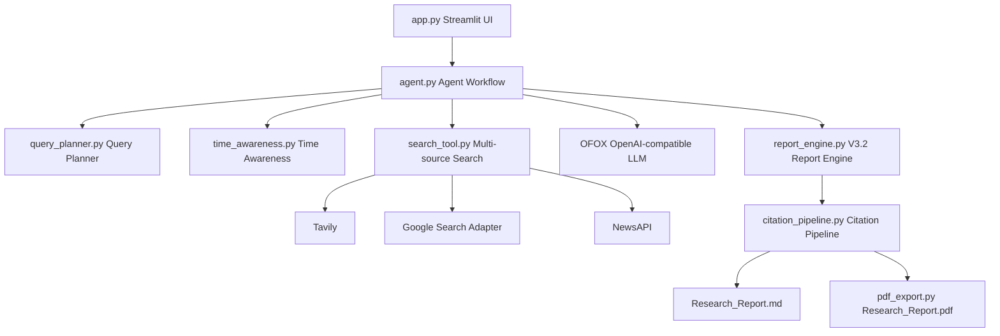

# web-search-agent

Web Search Agent V3.2 在 V2.2 Stable 的双语网页搜索总结能力、V3.0 Query Planner 和 V3.1 Citation Pipeline 之上，新增 Research Report Engine。它会识别用户问题中的时间范围，执行中英文多来源搜索，在研究型问题中自动拆解子问题，并用统一报告模板导出 Markdown 与 PDF。

## 项目架构



## V2.2 功能

- Tavily 搜索
- Google 搜索支持，可选配置
- NewsAPI 支持，可选配置
- 中英文双语搜索
- 时间感知搜索，例如“今天”“最近”“本周”“本月”
- 中文 / English 双语报告切换
- 来源统计，包括总来源数、搜索源分布、语言分布
- 搜索源状态展示，包括已启用、已跳过、失败原因

## V3.0 Query Planner

Query Planner 是一个可选增强功能，默认在 Streamlit 页面中开启。它不会替换 V2.2 的普通搜索流程，而是在搜索开始前判断用户问题类型：

- 普通搜索：继续使用原 V2.2 流程，执行 1 个主查询的中英文搜索。
- 研究任务：自动拆解为 3-5 个子问题，每个子问题包含 `title`、`query_zh`、`query_en`、`purpose`，再分别执行多来源搜索并融合结果。

普通搜索示例：

```text
今天 AI 有哪些新闻？
OpenAI 最新模型是什么？
```

研究任务示例：

```text
帮我研究 AI Agent 市场现状，包括主要公司、融资、商业模式和趋势。
分析 AI 产品经理岗位发展前景。
对比 LangGraph、CrewAI、AutoGen 的优缺点。
```

Planner 输出示例：

```json
{
  "is_research_task": true,
  "main_topic": "AI Agent 市场现状",
  "sub_queries": [
    {
      "title": "市场现状",
      "query_zh": "AI Agent 市场现状 2026",
      "query_en": "AI Agent market landscape 2026",
      "purpose": "了解整体市场发展情况"
    }
  ]
}
```

当 Planner 判断为研究任务时，最终中文报告会进入 V3.2 统一模板，并在 `Detailed Analysis` 中按照子问题组织内容：

```text
# Research Report

## Research Metadata
## Table of Contents
## Executive Summary
## Key Findings
## Detailed Analysis
## Evidence
## References
## Future Research
```

如果 Planner 调用失败或模型返回格式错误，系统会自动回退到 V2.2 普通搜索，并在页面的 `Query Planner` 折叠面板中显示失败提示。

## V3.1 Automatic Citation Pipeline

Automatic Citation Pipeline 是后台质量控制模块，不会在页面中显示额外的 Citation Check 面板。报告生成完成后，系统会自动处理引用编号：

- 自动校验报告中的 `[1]`、`[2]` 等引用编号。
- 删除不存在于搜索来源列表中的无效引用。
- 将有效引用转换为标准 Markdown 链接，例如 `[[1]](https://example.com)`。
- 用户在报告正文中点击 `[1]` 可以跳转到对应来源网页。
- 参考来源章节保持整洁，继续展示 source_id、标题和 URL。

页面仍然使用 `st.markdown()` 渲染报告，不使用 HTML 或 `unsafe_allow_html`。

## V3.2 Research Report Engine

V3.2 只升级最终研究报告，不修改搜索流程、Query Planner 或 Citation Pipeline。新的 `report_engine.py` 统一负责 Markdown 报告生成，并预留后续 Word 导出接口；`pdf_export.py` 使用 ReportLab 直接生成真正的 PDF 文件，不通过网页截图。

所有最终报告统一使用以下模板：

```text
# Research Report

## Research Metadata
## Table of Contents
## Executive Summary
## Key Findings
## Detailed Analysis
## Evidence
## References
## Future Research
```

当报告包含超过 5 个标准章节时，系统会自动生成 `Table of Contents`。`Detailed Analysis` 会按照 Query Planner 的子问题组织内容；普通搜索仍保留 V2.2 的搜索能力和 V3.1 的引用链接处理。

报告顶部会显示 Research Metadata，例如：

```text
Research ID: RPT-20260627-143015
Research Time: 2026-06-27 14:25 CST
Generated At: 2026-06-27 14:25 CST
Language: zh
Search Sources: tavily, google, newsapi
Total Sources: 18
Planner: Enabled
Time Range: 最近7天 (2026-06-21 to 2026-06-27)
Search Duration: 12.34s
```

每份报告都会生成唯一的 `Research ID`，格式为：

```text
RPT-YYYYMMDD-HHMMSS
```

Streamlit 页面新增 `Report Actions`：

- `Download Markdown`：下载当前页面一致的 `Research_Report.md`。
- `Download PDF`：下载当前报告生成的 `Research_Report.pdf`。
- `Copy Markdown`：显示当前 Markdown，便于复制。

下载按钮直接使用当前内存中的报告，不会重新搜索，也不会再次调用 LLM。

## 运行截图位置

运行截图建议放在：

```text
docs/screenshots/
```

## 环境变量

在项目根目录创建 `.env`，可参考 `.env.example`：

```env
# Tavily search API key. Required when using Tavily as a search source.
TAVILY_API_KEY=

# OFOX OpenAI-compatible API configuration. Required for translation and reports.
OFOX_API_KEY=
OFOX_BASE_URL=
OFOX_MODEL=

# Google Custom Search configuration. Optional search source configuration.
GOOGLE_API_KEY=
GOOGLE_CSE_ID=

# Serper Google Search configuration used by the current search_google() adapter.
# Optional. Leave empty to skip Google/Serper search.
SERPER_API_KEY=

# NewsAPI key. Optional. Leave empty to skip NewsAPI search.
NEWS_API_KEY=
```

Google 和 NewsAPI 都是可选配置。未配置时程序不会崩溃，页面会显示已跳过搜索源和跳过原因。

## 安装方法

```bash
pip install -r requirements.txt
```

## 启动方法

```bash
streamlit run app.py
```

示例输入：

```text
今天 AI 领域发生了哪些重要新闻？
```

页面会显示英文搜索关键词、时间范围、已启用搜索源、已跳过搜索源、来源统计、中文 / English 报告切换和结构化研究报告。

页面中可以通过 `启用 Query Planner` checkbox 开启或关闭 Planner。开启后，`Query Planner` expander 会显示 Planner 判断结果；如果是研究任务，还会显示自动拆解出的子查询列表。

## 项目目录

```text
app.py                    Streamlit 页面入口
agent.py                  Agent 主流程、双语搜索、报告生成、来源统计
query_planner.py          V3.0 Query Planner、JSON 解析和兜底逻辑
citation_pipeline.py      V3.1 引用校验、清理和 Markdown 链接转换
report_engine.py          V3.2 Markdown 报告模板、Metadata、Research ID
pdf_export.py             V3.2 ReportLab PDF 导出
search_tool.py            Tavily、Google、NewsAPI 搜索适配和结果合并
time_awareness.py         时间范围识别
requirements.txt          Python 依赖
test_citation_pipeline.py Citation Pipeline 单元测试
test_query_planner.py     Query Planner 和 Planner 集成测试
test_report_engine.py     Research Report Engine 和 PDF 导出测试
test_search.py            Agent 层测试
test_search_tool.py       搜索层测试
test_search_time_filters.py 时间过滤测试
test_time_awareness.py    时间识别测试
docs/screenshots/         运行截图目录
```

## 测试

```bash
python -m py_compile .
pytest
```
