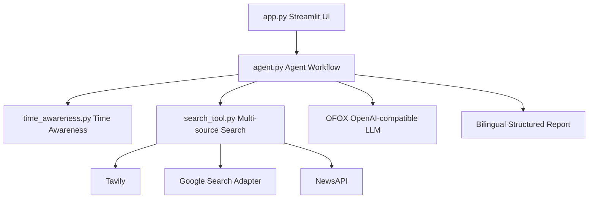

# web-search-agent

Web Search Agent V2.2 Stable 是一个基于 Streamlit 的双语网页搜索总结工具。它会识别用户问题中的时间范围，执行中英文多来源搜索，并生成可在中文和 English 之间切换的结构化研究报告。

## 项目架构



## V2.2 功能

- Tavily 搜索
- Google 搜索支持，可选配置
- NewsAPI 支持，可选配置
- 中英文双语搜索
- 时间感知搜索，例如“今天”“最近”“本周”“本月”
- 中文 / English 双语报告切换
- 来源统计，包括总来源数、搜索源分布、语言分布
- 搜索源状态展示，包括已启用、已跳过、失败原因

## 运行截图位置

运行截图建议放在：

```text
docs/screenshots/
```

## 环境变量

在项目根目录创建 `.env`，可参考 `.env.example`：

```env
# Tavily search API key. Required when using Tavily as a search source.
TAVILY_API_KEY=

# OFOX OpenAI-compatible API configuration. Required for translation and reports.
OFOX_API_KEY=
OFOX_BASE_URL=
OFOX_MODEL=

# Google Custom Search configuration. Optional search source configuration.
GOOGLE_API_KEY=
GOOGLE_CSE_ID=

# Serper Google Search configuration used by the current search_google() adapter.
# Optional. Leave empty to skip Google/Serper search.
SERPER_API_KEY=

# NewsAPI key. Optional. Leave empty to skip NewsAPI search.
NEWS_API_KEY=
```

Google 和 NewsAPI 都是可选配置。未配置时程序不会崩溃，页面会显示已跳过搜索源和跳过原因。

## 安装方法

```bash
pip install -r requirements.txt
```

## 启动方法

```bash
streamlit run app.py
```

示例输入：

```text
今天 AI 领域发生了哪些重要新闻？
```

页面会显示英文搜索关键词、时间范围、已启用搜索源、已跳过搜索源、来源统计、中文 / English 报告切换和结构化研究报告。

## 项目目录

```text
app.py                    Streamlit 页面入口
agent.py                  Agent 主流程、双语搜索、报告生成、来源统计
search_tool.py            Tavily、Google、NewsAPI 搜索适配和结果合并
time_awareness.py         时间范围识别
requirements.txt          Python 依赖
test_search.py            Agent 层测试
test_search_tool.py       搜索层测试
test_search_time_filters.py 时间过滤测试
test_time_awareness.py    时间识别测试
docs/screenshots/         运行截图目录
```

## 测试

```bash
python -m py_compile app.py agent.py search_tool.py time_awareness.py
pytest
```
